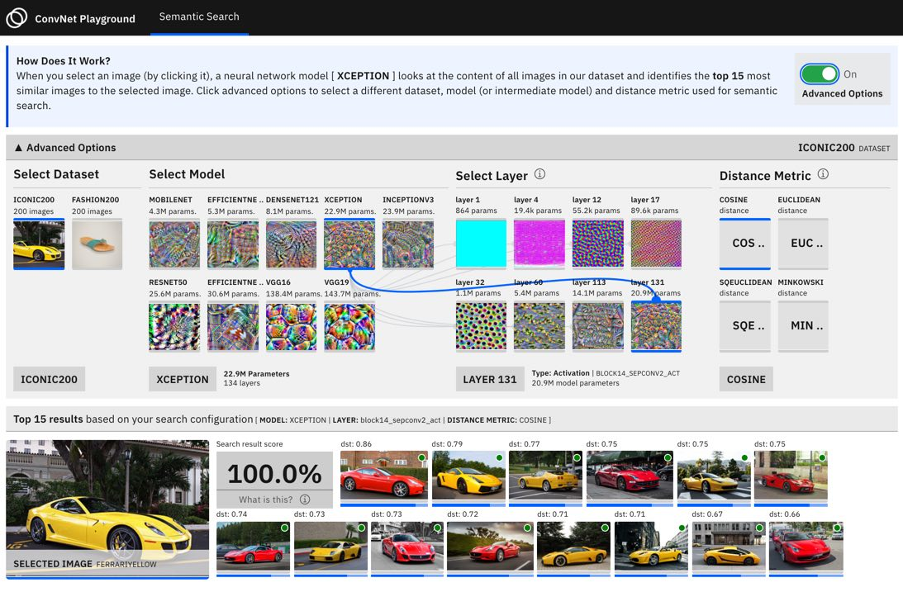

# Semantic Image Search with Convolutional Neural Networks

This repo explores how convolutional neural network models can be applied to the task of semantic search. It covers feature extraction, semantic search (image retrieval) and visualizations of search query performance for multiple datasets etc.

## Overview of Semantic Search

To enable semantic search applications, a few prerequisites stepss are helpful.

- Extracting semantic representations: In this step, the goal is to construct numeric representation of our data such that similar data items are numerically similar. In this example we use a pretrained convolutional neural network as a feature extractor for all entries in our dataset.
- Similarity Search: Given a new image (search query), this task focuses on identifying the k most similar items in the dataset. As the size of the dataset increases (think millions of datapoints), it becomes computationally slow to compare search queries with the entire dataset to identify most similar items. To address this, a set of scalable approximate nearest neighbour algorithms have been propossed. In this example, we use the methods implemented in the faiss package.

## Search on Your Own Data

    ├── app
    │   └── build
    ├── lib
    │   ├── extract.py
    │   └── model.py

This repo provides scripts and examples that can help you get started with semantic search on your own dataset.

- `lib/loader.py`: Load data from a directory in numpy arrays.
- `lib/model.py`: Load a pretrained model in tensorflow for feature extraction.
- `lib/faissindex.py` : Create a FAISS index.

The repo also provides a [tutorial](/notebooks/Tutotrial.ipynb) notebook with visualizations that walksthrough the semantic search process.
