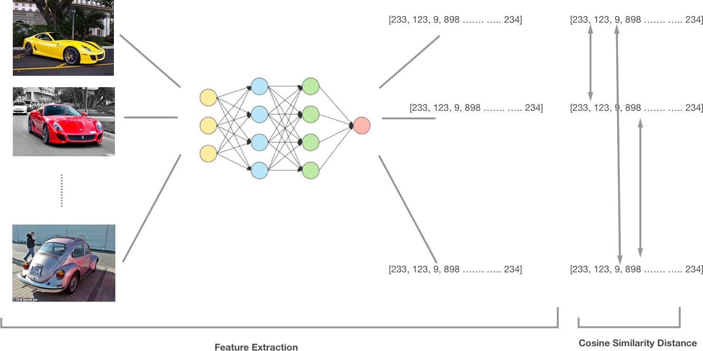

# Semantic Image Search with Convolutional Neural Networks

> A prototype that allows you explore how convolutional neural network models. It covers areas like feature extraction and semantic search (image retrieval), visualizations of search query performance for multiple datasets etc.

https://github.com/fastforwardlabs/semsearch

## Prototype

ConvNet Playground, the prototype created for this report, allows users to explore representations learned by a CNN model and has two main parts. The first part - Semantic Search demonstrates an example of using layers from pretrained CNN models to extract features which are then used to implement similarity search. The intuition here is that various layers in a CNN have learned important concepts which allows them extract meaningful representations that capture the similarity between images. The second part of the prototype - Model Explorer is a visualization tool that allows the user inspect features learned by layers in a CNN and in so doing build better intuition on how CNNs work.

## Semantic Similarity Search

We define the task of semantic search as follows:

> Given a dataset of existing images, and a new arbitrary image, find a subset of images from the dataset that are most similar to the new image.

Semantic similarity search is performed as a three step process. First, a pretrained CNN model is used to extract features (represented as vectors) from each image in the dataset. Next, a distance metric is used to compute the distance between each image vector and all other image vectors in the dataset. Finally, to perform a search, we retrieve the precomputed distance values between the searched image and all other images sorted in the order of _closest_ to _farthest_.

In practice, there are many choices to be made while implementing a similarity search tool based on convolutional neural networks. An appropriate model architecture needs to be selected, appropriate layers from the model and an appropriate distance metric. The prototype allows the user explore results from these configurations across several datasets.

## Repo Structure
